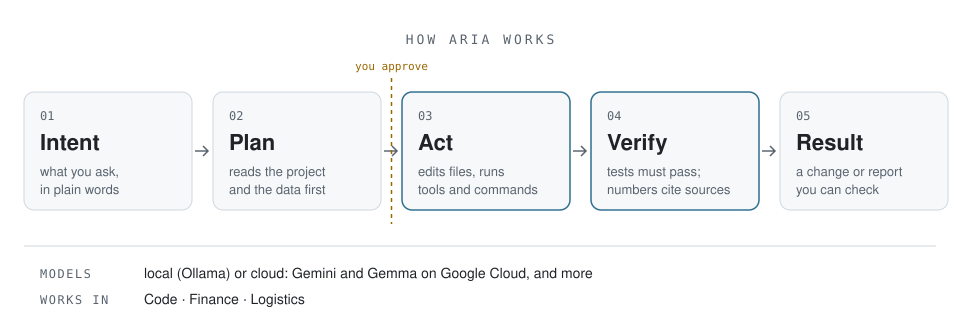

  <picture>
    <source media="(prefers-color-scheme: dark)" srcset="assets/aria-mark-dark.png">
    
  </picture>

<h1 align="center">Xindi Wang</h1>

  Founder of <b>Arthera</b> · Building <b>Aria</b>

  I build AI systems that move from <b>intent to execution</b>: 
  across code, financial research and logistics operations, with work you can check.

  <a href="https://github.com/artheras/aria-code">Aria Code</a> ·
  <a href="https://arthera.finance">Arthera</a> ·
  <a href="https://github.com/artheras">GitHub org</a> ·
  <a href="https://www.linkedin.com/in/xindi-wang19990526">LinkedIn</a> ·
  <a href="https://xindi-blog.vercel.app">Blog</a>

 

## Building systems, not chatbots

I'm building **Aria**, an AI agent that does real work inside a real workspace: it reads the project and the data, uses tools, and leaves results behind that someone can verify.

My focus is on what makes an agent trustworthy enough to hand real work to: numbers that come from stated formulas and named data, one client's data kept apart from another's, and nothing written or run until a person approves it.

I'm most interested in agent systems, evaluation, quantitative finance, logistics operations and developer tools.

 

## Aria Code

**The open, terminal-first interface to Aria.** It inspects projects, works with live data, writes and runs code, and checks its own work before calling a task done.

  
   
  A real session, not a mock-up: Aria writes a module and its tests, runs them once each step is approved, then reviews the change.

<table>
  <tr>
    <td width="33%" valign="top">
      
      <h4>Code</h4>
      Writes code and builds projects. A change is done when the project's tests pass, and <code>/review</code> checks it like a careful colleague.
    </td>
    <td width="33%" valign="top">
      
      <h4>Finance</h4>
      Market data, risk, earnings and backtests. Every result names its data source, period and gaps.
    </td>
    <td width="33%" valign="top">
      
      <h4>Logistics</h4>
      Inventory policy, carrier scoring and freight audits, one shipper's data at a time, with the formula in the result.
    </td>
  </tr>
</table>

  <a href="https://github.com/artheras/aria-code"><b>Explore Aria Code →</b></a>

 

  <picture>
    <source media="(prefers-color-scheme: dark)" srcset="assets/aria-flow-dark.svg">
    
  </picture>

 

## Shipped, and checkable

<table>
  <tr>
    <td width="33%" valign="top"><b>67 releases</b> on <a href="https://pypi.org/project/aria-code/">PyPI</a> and <a href="https://www.npmjs.com/package/@artheras/aria-code">npm</a>, with native binaries for macOS, Linux and Windows</td>
    <td width="33%" valign="top"><b>40-task eval suite</b> across coding, finance and logistics, each task built around a tempting wrong answer (<a href="https://github.com/artheras/aria-code/blob/main/docs/verifiable-evals.md">how it works</a>)</td>
    <td width="33%" valign="top"><b>Open source</b> <a href="https://github.com/artheras/aria-code/blob/main/LICENSE">Apache-2.0</a>; runs on local models or in the cloud</td>
  </tr>
</table>

 

## Projects

| | Project | What it is |
|---|---|---|
| **Flagship** | [Aria Code](https://github.com/artheras/aria-code) | The open AI agent for coding, financial research and logistics operations |
| **Now** | [Stablecoin settlement audit](https://github.com/artheras/skills/tree/main/skills/stablecoin-settlement-audit) | Reconciles freight invoices against USDC payments: paid twice, short-paid, or sent to the wrong address. Read-only; it never touches keys |
| **Skills** | [Arthera skills](https://github.com/artheras/skills) | Reusable agent skills for finance and logistics research, usable by Aria Code and other agents |
| **Applied** | [Beichen Cloud Warehouse ERP](https://cinsoul.github.io/beichen-warehouse-erp-demo/) | A demo ERP for an overseas warehouse: receiving, storage locations, tasks and shipment tracking |
| **Writing** | [Xindi's Blog](https://xindi-blog.vercel.app) | My personal blog, built with React and TypeScript |

 

## Current focus

**Aria**: agents that finish real work and show how they got there. 
**Agent systems**: tool use, permissions, verification and evaluation. 
**AI × finance**: market data, risk and backtests that don't borrow from the future. 
**AI × logistics**: inventory, carriers and settlement, client by client.

 

  Python · TypeScript · LLM agents · MCP · Ollama · Gemini on Vertex AI · evals

